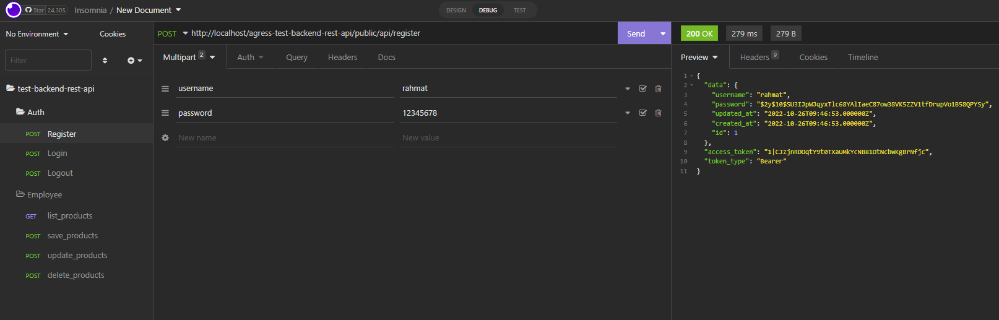
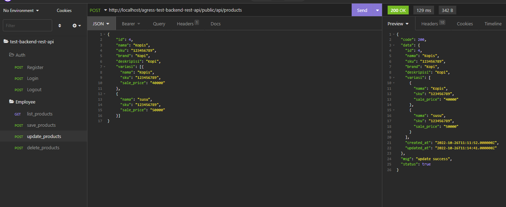

# Requirements
```
	PHP 7.4
	Laravel 8
	Mysql 5.7.36 must support type data JSON
```


# Installation

1. Clone this repo

```
git clone https://github.com/mohrahmatullah/agress-test-backend-rest-api.git
```


2. Setup

```
$ cd agress-test-backend-rest-api
$ composer install
$ php artisan key:generate
$ copy .env.example .env

put database credentials in .env file
```

3. Migrate and insert records

```
$ php artisan migrate
```

atau bisa import database dari folder
```
	sql/agress-test-backend-rest-api.sql
```

4. Insomnia

```
	- Silahkan Import file json insomnia ke aplikasi insomnia untuk melihat formatnya insomnia collection
	- filenya ada di folder
	
	insomnia/insomnia..

```


## User Registration.



## User Login.


## User Logout.


## List Product With Token.


## Create Product With Body And Token.


## Update Product With Body And Token.




## Delete Product With Body And Token.


